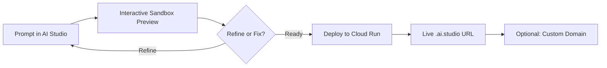

<div align="center">


# Launch Your Portfolio Website with AI

[](https://codelabs.developers.google.com/)
[](https://cloud.google.com/run)
[](https://aistudio.google.com/apps)
[](https://developers.google.com/profile/badges/builder/milestone1/award?authuser=1)

A step-by-step developer codelab demonstrating how to prototype, customize, and deploy a personal portfolio website in minutes using Google AI Studio Build Mode and Google Cloud Run.

[Overview](#overview) • [Codelab Modules](#codelab-modules) • [Prerequisites](#prerequisites) • [Workflow](#workflow) • [Video Guide](#video-walkthrough) • [Badges & Next Steps](#badges--next-steps)

</div>

---

## Overview

This repository contains the complete documentation, step-by-step guides, and video transcript for the **Google Codelab: Launch Your Portfolio Website with AI** by Luke Schlangen.

Modern AI tooling makes web prototyping instantaneous. By leveraging **Google AI Studio's Build Mode** ("vibe coding"), developers can prompt Gemini models in natural language to design full-featured responsive frontend applications. Once iterated and tested within AI Studio's interactive preview sandbox, the application can be packaged into a serverless container and deployed to **Google Cloud Run** with a single click.

> [!NOTE]
> AI Studio Build Mode provides an interactive sandbox environment that renders code live as Gemini generates it, allowing real-time inspection, styling adjustments, and automated code-fixing directly from the chat interface.

---

## Codelab Modules

Follow each module in order to build and launch your personal portfolio:

| Step | Guide | Description |
| :--- | :--- | :--- |
| **00** | [Full Walkthrough & Transcript](code-labs/00-Launch_your_portfolio_website_with_AI.md) | Complete guide and verbatim video transcript of the codelab demo. |
| **01** | [Introduction](code-labs/01-Introduction.md) | Overview of AI Studio Build Mode, objectives, and video demo. |
| **02** | [Project Setup](code-labs/02-Project_Setup.md) | Account verification, Google Cloud Starter Tier vs. Standard deployment tiers. |
| **03** | [Create Portfolio](code-labs/03-Create_Portfolio.md) | Formulating prompts in AI Studio Build Mode to generate portfolio UI. |
| **04** | [Test and Iterate](code-labs/04-Test_and_Iterate.md) | Validating UI in the live preview sandbox and using the automated Fix assistant. |
| **05** | [Deploy to Cloud Run](code-labs/05-Deploy_to_Cloud_Run.md) | 1-click deployment wizard, setting `.ai.studio` custom prefixes, and container publishing. |
| **06** | [Add Custom Domain](code-labs/06-Add_custom_domain.md) | *(Optional)* Configuring DNS records (`A`, `AAAA`, `CNAME`) and automated SSL certificate provisioning. |
| **07** | [Clean Up](code-labs/07-Clean_Up.md) | Unpublishing services, deleting app state, or shutting down Google Cloud projects. |
| **08** | [Conclusion](code-labs/08-Conclusion.md) | Wrap-up and claiming your Builder Journey completion badge. |

---

## Prerequisites

Before starting this codelab, ensure you have:

- **A personal Google Account**: Standard personal accounts are recommended. Corporate or institutional Workspace accounts may restrict experimental AI features or cloud publishing.
- **Access to Google AI Studio**: Navigate to [Google AI Studio Apps](https://aistudio.google.com/apps?authuser=1).
- **Google Cloud Tier**:
  - **Starter Tier**: Deploy up to two full-stack applications at no cost without needing a full billing account.
  - **Standard Deployment**: Connect to an existing paid Google Cloud project for higher CPU, memory, and custom resource limits.

---

## Workflow



### 1. Prompting the Agent
Launch a **New App** in the [Google AI Studio Apps Panel](https://aistudio.google.com/apps?authuser=1) and supply your prompt:

```text
Build a professional personal portfolio website. The site should
have a modern, responsive design and sections for my biography,
projects showcase, skills, and links to my professional profiles
(e.g., GitHub, LinkedIn).
```

> [!TIP]
> Provide context such as your resume text, bio details, or links to existing profiles to reduce hallucinations and make the portfolio tailored to your background.

### 2. Testing and Iterating
Verify navigation, links, and styling in the interactive preview pane:
- Use follow-up prompts to tailor styles (e.g., *"Style with Tailwind CSS and add dark mode toggle"*).
- Use the **Fix** button if the model encounters syntax or rendering errors to let the agent self-heal the code.

### 3. Deploying to Cloud Run
1. Click **Publish** in AI Studio.
2. Select your Google Cloud Project.
3. Set your preferred `.ai.studio` subdomain prefix (e.g., `my-portfolio.ai.studio`).
4. Click **Publish App**. Google Cloud Run builds and registers the container image and exposes an HTTPS URL in 2–4 minutes.

> [!IMPORTANT]
> To prevent unwanted cloud charges when you are done experimenting, visit the [AI Studio Apps Dashboard](https://aistudio.google.com/app/apps?authuser=1) and delete unused apps or unpublish Cloud Run services as detailed in [07-Clean_Up.md](code-labs/07-Clean_Up.md).

---

## Video Walkthrough

Prefer following along visually? Watch the official walkthrough:

[](https://www.youtube.com/watch?v=xaYkxHCRmhE)

Watch on YouTube: [Launch your portfolio website with AI](https://www.youtube.com/watch?v=xaYkxHCRmhE)

---

## Badges & Next Steps

- Claim your [Completed Builder Journey Badge](https://developers.google.com/profile/badges/builder/milestone1/award?authuser=1) upon finishing the lab.
- Explore additional labs and tutorials on [goo.gle/builders](https://goo.gle/builders).
